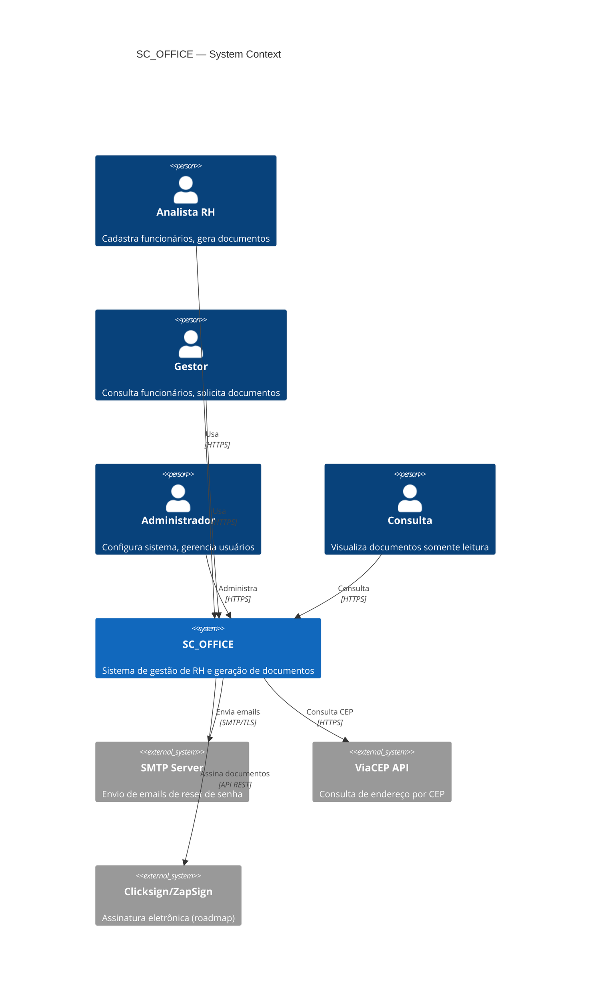
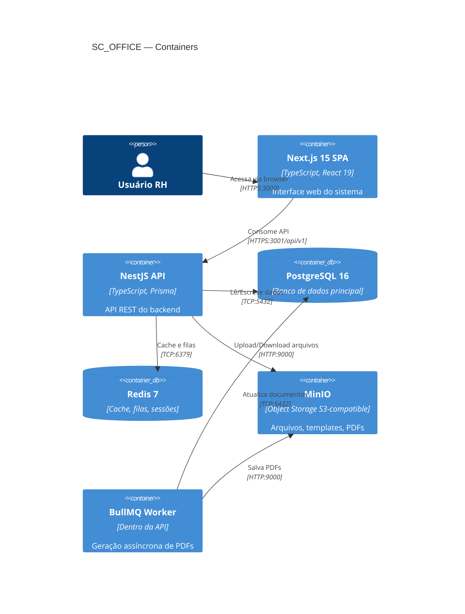
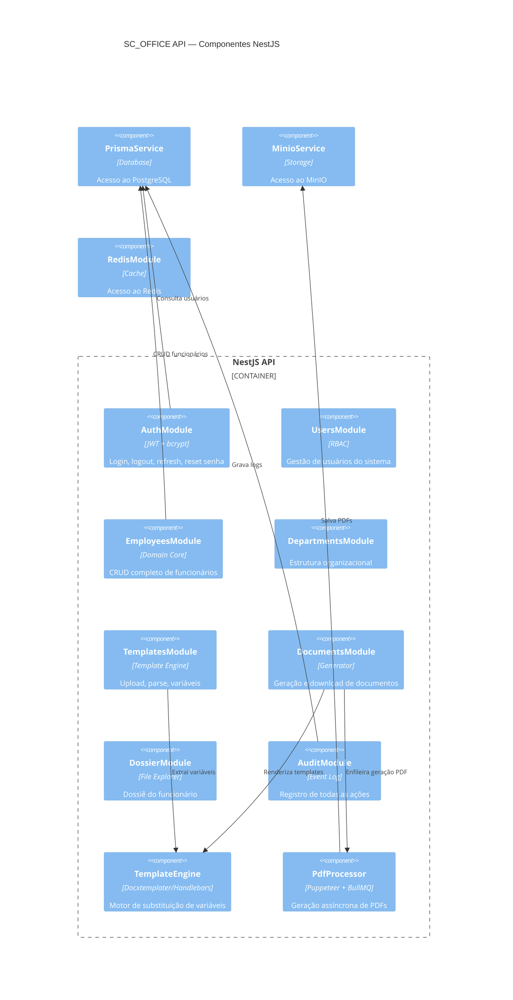
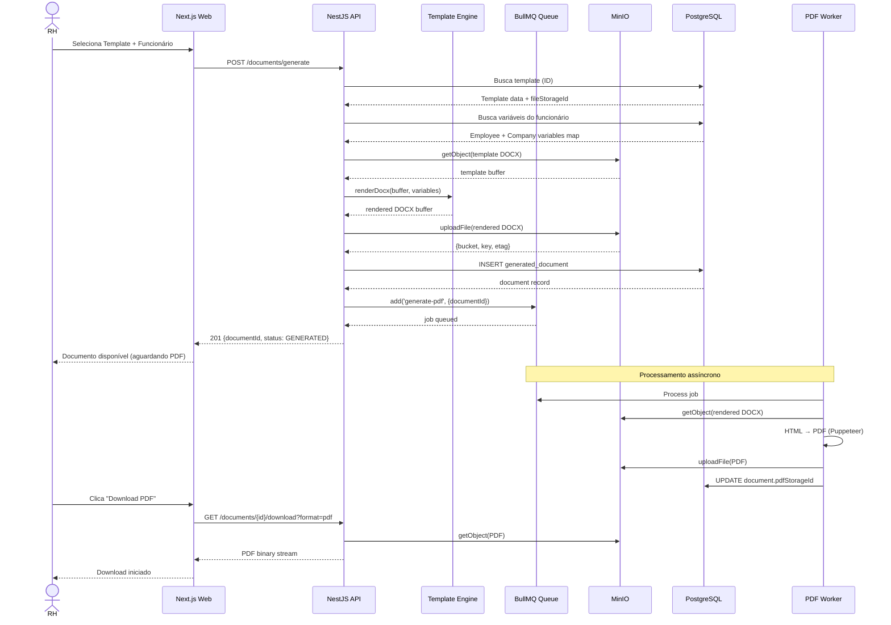
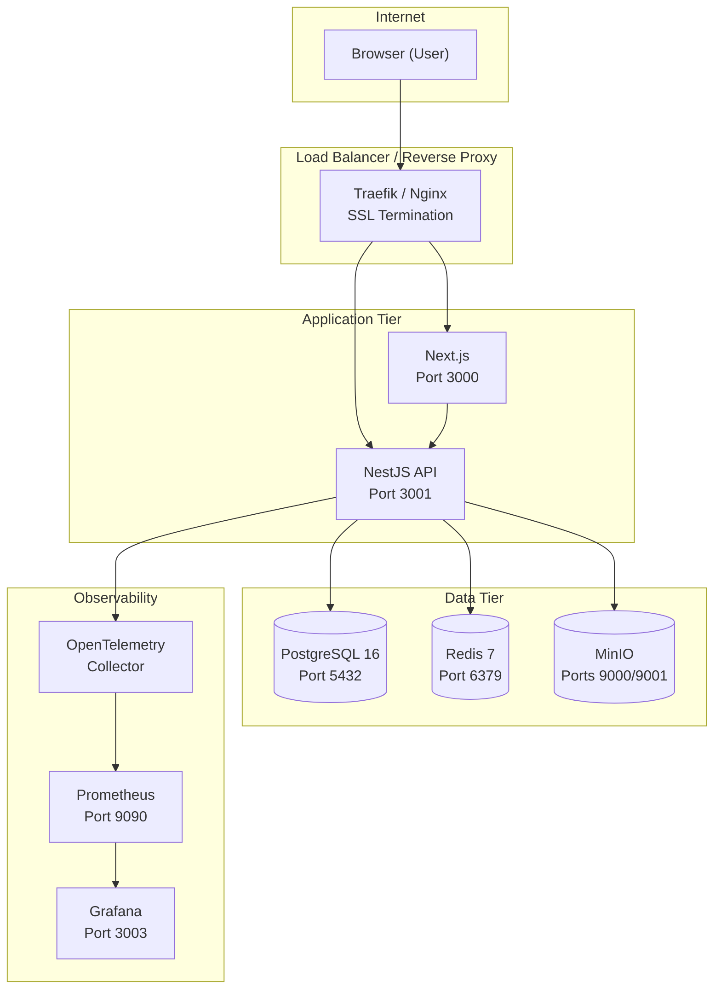
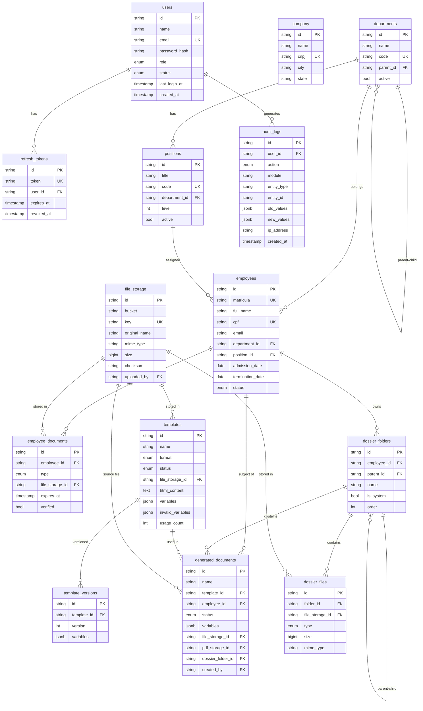

# SC_OFFICE — Arquitetura Definitiva

## 1. Visão Geral

SC_OFFICE é um sistema interno de RH para uma única organização.
Implementa um **Monólito Modular** com Clean Architecture, DDD tático e SOLID.

### Decisões Arquiteturais

| Decisão | Escolha | Razão |
|---|---|---|
| Estrutura | Monólito Modular | Equipe única, domínio coeso, evita complexidade de microsserviços |
| ORM | Prisma | Type-safety, migrations automáticas, DX superior |
| Storage | MinIO | S3-compatible, self-hosted, custo zero em infra própria |
| Queue | BullMQ + Redis | PDF é operação pesada; fila evita timeout HTTP |
| Cache | Redis | Sessões, rate limiting, cache de queries frequentes |
| PDF | Puppeteer | HTML → PDF de alta qualidade com cabeçalho/rodapé profissional |
| Template Engine | Docxtemplater + Handlebars | DOCX nativo para documentos jurídicos; HTML para flexibilidade |
| Auth | JWT + Refresh Token Rotation | Stateless, seguro, revogável via blacklist Redis |

---

## 2. Context Diagram (C4 Nível 1)



---

## 3. Container Diagram (C4 Nível 2)



---

## 4. Component Diagram — API (C4 Nível 3)



---

## 5. Sequence Diagram — Fluxo Principal: Gerar Documento



---

## 6. Deployment Diagram



---

## 7. Bounded Contexts

### 7.1 Identity & Access Management
- Entidades: `User`, `RefreshToken`, `PasswordReset`
- Responsabilidade: Autenticação, autorização RBAC
- Isolado via módulo `AuthModule`

### 7.2 Organizational Structure
- Entidades: `Department`, `Position`
- Responsabilidade: Hierarquia organizacional, cargos
- Permite organograma futuro

### 7.3 Employee Management (Core Domain)
- Entidades: `Employee`, `EmployeeDocument`
- **Aggregate Root**: `Employee`
- Responsabilidade: Todo o ciclo de vida do funcionário

### 7.4 Document Generation (Core Domain)
- Entidades: `Template`, `TemplateVersion`, `GeneratedDocument`
- **Aggregate Root**: `Template`
- Responsabilidade: Motor de templates, substituição de variáveis, geração de PDFs

### 7.5 Employee Dossier
- Entidades: `DossierFolder`, `DossierFile`
- **Aggregate Root**: `DossierFolder`
- Responsabilidade: Explorador de arquivos do funcionário

### 7.6 Audit & Compliance
- Entidades: `AuditLog`
- Responsabilidade: Rastreabilidade de todas as ações
- Transversal (global module)

### 7.7 Storage
- Entidades: `FileStorage`
- Responsabilidade: Abstração do MinIO

---

## 8. Entidades e Value Objects

### Employee (Aggregate Root)

```typescript
// Value Objects
class CPF { value: string; validate(): boolean }
class RG { value: string; issuingBody: string; state: string }
class Address { zipCode: string; street: string; city: string; state: string }
class ContactInfo { email: string; phone?: string; cellphone?: string }
class BankInfo { bankName: string; agency: string; account: string; pix?: string }
class ProfessionalInfo { admissionDate: Date; position: Position; department: Department }

// Aggregate
class Employee {
  readonly id: string
  personalData: PersonalData
  contactInfo: ContactInfo
  address: Address
  bankInfo: BankInfo
  professionalInfo: ProfessionalInfo
  status: EmployeeStatus
  
  // Domain events
  admit(): EmployeeAdmittedEvent
  terminate(date: Date): EmployeeTerminatedEvent
  updatePosition(position: Position): PositionChangedEvent
  toVariablesMap(): Record<string, string>  // Template variables
}
```

### Template (Aggregate Root)

```typescript
class Template {
  readonly id: string
  name: string
  format: TemplateFormat  // DOCX | HTML
  variables: VariableInfo[]
  invalidVariables: VariableInfo[]
  status: TemplateStatus
  
  activate(): void
  archive(): void
  extractVariables(): VariableInfo[]
  validateVariables(): ValidationResult
}
```

---

## 9. Estrutura Completa do Banco de Dados (ERD)



---

## 10. RBAC — Matriz de Permissões

| Módulo | Operação | ADMIN | RH | GESTOR | CONSULTA |
|--------|----------|:-----:|:--:|:------:|:--------:|
| **Funcionários** | Criar | ✅ | ✅ | ❌ | ❌ |
| **Funcionários** | Visualizar | ✅ | ✅ | ✅ | ✅ |
| **Funcionários** | Editar | ✅ | ✅ | ❌ | ❌ |
| **Funcionários** | Excluir | ✅ | ❌ | ❌ | ❌ |
| **Funcionários** | Exportar | ✅ | ✅ | ✅ | ❌ |
| **Templates** | Criar/Editar | ✅ | ✅ | ❌ | ❌ |
| **Templates** | Visualizar | ✅ | ✅ | ✅ | ✅ |
| **Templates** | Excluir | ✅ | ✅ | ❌ | ❌ |
| **Documentos** | Gerar | ✅ | ✅ | ✅ | ❌ |
| **Documentos** | Visualizar | ✅ | ✅ | ✅ | ✅ |
| **Documentos** | Download | ✅ | ✅ | ✅ | ✅ |
| **Dossiê** | Upload | ✅ | ✅ | ✅ | ❌ |
| **Dossiê** | Visualizar | ✅ | ✅ | ✅ | ✅ |
| **Dossiê** | Excluir | ✅ | ✅ | ❌ | ❌ |
| **Usuários** | Gerenciar | ✅ | ❌ | ❌ | ❌ |
| **Auditoria** | Visualizar | ✅ | ❌ | ❌ | ❌ |
| **Empresa** | Configurar | ✅ | ❌ | ❌ | ❌ |
| **Departamentos** | Gerenciar | ✅ | ✅ | ❌ | ❌ |
| **Departamentos** | Visualizar | ✅ | ✅ | ✅ | ✅ |

---

## 11. Variáveis do Motor de Templates

### Grupo: Funcionário
| Variável | Descrição |
|----------|-----------|
| `{{funcionario.nome}}` | Nome completo |
| `{{funcionario.nome_social}}` | Nome social |
| `{{funcionario.cpf}}` | CPF formatado |
| `{{funcionario.rg}}` | RG |
| `{{funcionario.email}}` | Email |
| `{{funcionario.telefone}}` | Telefone fixo |
| `{{funcionario.celular}}` | Celular |
| `{{funcionario.data_nascimento}}` | Data de nascimento (dd/mm/aaaa) |
| `{{funcionario.genero}}` | Gênero |
| `{{funcionario.estado_civil}}` | Estado civil |
| `{{funcionario.nacionalidade}}` | Nacionalidade |
| `{{funcionario.matricula}}` | Número de matrícula |
| `{{funcionario.cargo}}` | Título do cargo |
| `{{funcionario.setor}}` | Nome do setor |
| `{{funcionario.data_admissao}}` | Data de admissão |
| `{{funcionario.data_demissao}}` | Data de demissão |
| `{{funcionario.endereco}}` | Endereço completo |
| `{{funcionario.cep}}` | CEP |
| `{{funcionario.rua}}` | Rua |
| `{{funcionario.cidade}}` | Cidade |
| `{{funcionario.estado}}` | UF |
| `{{funcionario.banco}}` | Nome do banco |
| `{{funcionario.pix}}` | Chave PIX |
| `{{funcionario.pis}}` | PIS/PASEP |
| `{{funcionario.ctps}}` | CTPS |

### Grupo: Empresa
| Variável | Descrição |
|----------|-----------|
| `{{empresa.nome}}` | Razão social |
| `{{empresa.nome_fantasia}}` | Nome fantasia |
| `{{empresa.cnpj}}` | CNPJ |
| `{{empresa.endereco}}` | Endereço completo |
| `{{empresa.cidade}}` | Cidade |
| `{{empresa.estado}}` | UF |
| `{{empresa.telefone}}` | Telefone |
| `{{empresa.email}}` | Email |

### Grupo: Data
| Variável | Descrição |
|----------|-----------|
| `{{data.hoje}}` | Data atual (dd/mm/aaaa) |
| `{{data.hoje_extenso}}` | Por extenso |
| `{{data.ano}}` | Ano atual |
| `{{data.mes}}` | Mês atual |
| `{{data.dia}}` | Dia atual |

---

## 12. Estratégias

### Cache (Redis)
- **Rate limiting**: 10 req/s por IP (Throttler)
- **Sessões de refresh token**: TTL = 7 dias
- **Query cache**: Listas de departamentos, cargos (TTL 10min)
- **Blacklist de tokens revogados**: Checagem rápida sem hit no DB

### Filas (BullMQ)
- **Fila `pdf-generation`**: Workers para gerar PDF com Puppeteer
  - Concorrência: 2 workers simultâneos
  - Retry: 3 tentativas com backoff exponencial
  - TTL job: 1 hora
- **Fila `email`** (futuro): Envio de emails
- **Fila `audit`** (futuro): Processamento assíncrono de logs massivos

### Storage (MinIO)
```
Buckets:
├── sc-templates/         # Templates DOCX/HTML uploaded pelo RH
│   └── templates/        # {cuid}.docx
├── sc-documents/         # Documentos gerados
│   ├── documents/{employeeId}/  # DOCX gerado
│   └── pdf/{employeeId}/        # PDF final
├── sc-employees/         # Fotos de perfil dos funcionários
├── sc-dossier/           # Arquivos do dossiê
│   └── dossier/{employeeId}/
├── sc-company/           # Logo e docs da empresa
└── sc-temp/              # Arquivos temporários (TTL 24h)
```

### Backup e DR
- **PostgreSQL**: pg_dump diário (S3/MinIO), PITR habilitado
- **Redis**: AOF + RDB snapshot, backup diário
- **MinIO**: Replicação cross-bucket, backup para S3 externo
- **RTO** (Recovery Time Objective): < 4h
- **RPO** (Recovery Point Objective): < 1h

### Segurança
- JWT com rotação de Refresh Token
- Rate limiting multicamada (short/medium/long)
- Helmet para headers HTTP seguros
- CORS restrito à origem específica
- Validação de upload (tipo MIME + tamanho)
- SQL injection: impossível via Prisma ORM
- XSS: sanitização via class-validator + Handlebars escape
- CSRF: SameSite=Strict nos cookies
- Audit log de todas as ações sensíveis

---

## 13. Roadmap

### MVP (Semanas 1-8)
- [x] Autenticação completa (JWT + Refresh)
- [x] CRUD de Funcionários
- [x] Estrutura organizacional (Departamentos + Cargos)
- [x] Upload e parse de templates DOCX/HTML
- [x] Motor de variáveis + validação
- [x] Geração de documentos preenchidos
- [x] Geração de PDF via Puppeteer
- [x] Dossiê do funcionário (explorador de arquivos)
- [x] Auditoria básica
- [x] Docker Compose completo

### Produção (Semanas 9-16)
- [ ] RBAC granular por recurso
- [ ] Notificações em tempo real (WebSocket/SSE)
- [ ] Dashboard com métricas (Grafana)
- [ ] Recuperação de senha por email
- [ ] Versionamento de templates
- [ ] Pré-visualização de documento antes de gerar
- [ ] Testes E2E com Playwright
- [ ] Pipeline CI/CD completo

### Enterprise (Pós v1.0)
- [ ] **Assinatura eletrônica** (Clicksign, ZapSign, DocuSign)
- [ ] Fluxo de aprovação de documentos
- [ ] Organograma visual interativo
- [ ] Importação em massa de funcionários (CSV/Excel)
- [ ] Portal do funcionário (autoatendimento)
- [ ] App mobile (React Native)
- [ ] Ponto eletrônico integrado
- [ ] Integração com ERPs (SAP, TOTVS)
- [ ] eSocial / FGTS digital
- [ ] Multi-idioma

---

## 14. Assinatura Eletrônica — Plano de Evolução

### Arquitetura proposta
```
GeneratedDocument
    ↓ status: GENERATED
Enviar para assinatura
    ↓ POST /documents/{id}/send-for-signature
    ↓ {provider: 'clicksign' | 'zapsign' | 'docusign'}
SignatureProvider (Strategy Pattern)
    ├── ClicksignProvider
    ├── ZapSignProvider
    └── DocuSignProvider
    ↓ Webhook recebe evento de assinatura
    ↓ DocumentSigned event
    ↓ status: SIGNED
    ↓ Arquivo assinado salvo no MinIO
```

### Modelo de dados adicional (futuro)
```sql
CREATE TABLE document_signatures (
  id          VARCHAR PRIMARY KEY,
  document_id VARCHAR REFERENCES generated_documents(id),
  provider    VARCHAR(20),   -- 'clicksign' | 'zapsign' | 'docusign'
  external_id VARCHAR,       -- ID no provedor
  status      VARCHAR(20),   -- pending | signed | declined | expired
  signed_at   TIMESTAMP,
  signed_by   VARCHAR,
  signed_url  VARCHAR,       -- URL do documento assinado
  metadata    JSONB,
  created_at  TIMESTAMP DEFAULT NOW()
);
```

---

## 15. Estimativa de Esforço

| Módulo | Complexidade | Esforço (dev-days) |
|--------|-------------|-------------------|
| Auth + RBAC | Média | 5 |
| Funcionários (CRUD + validações) | Alta | 8 |
| Departamentos + Cargos | Baixa | 3 |
| Motor de Templates (DOCX + HTML) | Alta | 10 |
| Geração de Documentos + PDF | Alta | 8 |
| Dossiê do Funcionário | Média | 6 |
| Frontend completo | Alta | 20 |
| DevOps (Docker, CI/CD, K8s) | Média | 5 |
| Testes (unit + E2E) | Média | 8 |
| **Total MVP** | | **~73 dev-days** |

---

## 16. Riscos Técnicos

| Risco | Probabilidade | Impacto | Mitigação |
|-------|--------------|---------|-----------|
| Conversão DOCX→PDF fidelidade | Alta | Médio | Usar LibreOffice headless em produção |
| Performance Puppeteer em escala | Média | Alto | BullMQ concurrency limit + pool de browsers |
| Tamanho de templates DOCX | Baixa | Médio | Validar tamanho no upload (max 50MB) |
| Conflito de variáveis customizadas | Média | Baixo | Registry extensível com namespace |
| Crescimento do MinIO | Baixa | Alto | Lifecycle policies para sc-temp |
| Memória do Redis | Baixa | Médio | maxmemory-policy allkeys-lru |

---

## 17. Sequência de Implementação

```
Fase 1: Fundação (Semana 1-2)
  1. Monorepo + Docker Compose
  2. NestJS boilerplate + Prisma schema
  3. Auth module (login/logout/refresh)
  4. User module

Fase 2: Core Domain (Semana 3-4)
  5. Departments + Positions
  6. Employees CRUD completo
  7. MinIO integration
  8. File upload básico

Fase 3: Template Engine (Semana 5-6)
  9. Template upload + parse de variáveis
  10. Template engine (DOCX + HTML)
  11. Document generation
  12. PDF generation (BullMQ + Puppeteer)

Fase 4: Dossiê + Frontend (Semana 7-8)
  13. Dossier (pastas + upload + download)
  14. Audit module completo
  15. Next.js layout + auth
  16. Páginas: login, employees, templates, documents, dossier

Fase 5: Produção (Semana 9-16)
  17. Testes completos
  18. CI/CD pipeline
  19. Kubernetes manifests
  20. Monitoring (Prometheus + Grafana)
  21. Documentação final
```
